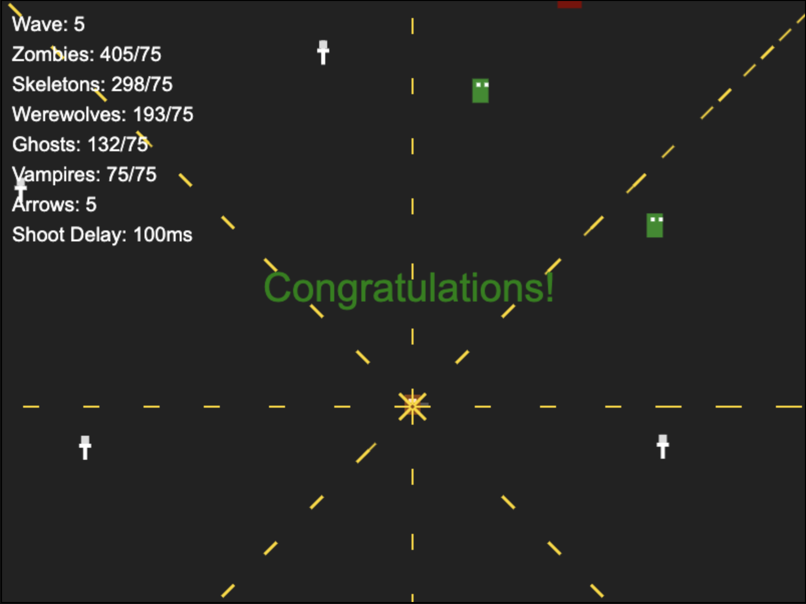

# Night Hunter’s Stand

Welcome to **Night Hunter’s Stand**, a thrilling HTML5 survival game built with JavaScript and Canvas! Play as a Van Helsing-inspired night hunter, wielding an auto-firing bowgun to fend off waves of supernatural creatures in a dark, nocturnal world.

## Play the Game
You can play Night Hunter’s Stand directly in your browser via GitHub Pages:  
[**Play Now!**](https://yourusername.github.io/night-hunters-stand/)

(Replace `yourusername` with your actual GitHub username after hosting.)

## Game Overview
In Night Hunter’s Stand, you face escalating waves of enemies:
- **Wave 1**: Zombies only (75 kills to advance).
- **Wave 2**: Zombies + Skeletons (75 each).
- **Wave 3**: Zombies + Skeletons + Werewolves (75 each).
- **Wave 4**: Zombies + Skeletons + Werewolves + Ghosts (75 each).
- **Wave 5**: All enemies (Zombies, Skeletons, Werewolves, Ghosts, Vampires) - 75 kills each to win!

Survive as long as you can, upgrading your bowgun’s firing rate and arrow count as you rack up kills.

## Screenshot
Here’s a glimpse of the action in Night Hunter’s Stand:  

### Controls
- **Desktop**: Use **WASD** keys to move the hunter.
- **Mobile**: Press and hold on the screen to move the hunter toward that point; release to stop.
- **Shooting**: The bowgun fires automatically in 8 directions (no manual aiming required).

### Enemies
- **Zombie**: Speed 1, HP 1 (easy prey).
- **Skeleton**: Speed 1.2, HP 3 (slow but durable).
- **Werewolf**: Speed 2, HP 4 (fast and tough).
- **Ghost**: Speed 2.5, HP 2 (swift but fragile).
- **Vampire**: Speed 1.5, HP 5 (the ultimate challenge).

### Bowgun Upgrades
- **Shoot Delay**: Decreases by 50ms every 100 kills (from 500ms to a minimum of 100ms).
- **Arrows Per Shot**: Increases by 1 every 150 kills (up to 5 arrows per direction).

## How to Run Locally
1. Download the `index.html` file from this repository.
2. Open it in a web browser (e.g., Chrome, Firefox) on desktop or mobile.
3. Start playing—no additional setup required!

## Development
- **Built With**: HTML5, JavaScript, Canvas API.
- **Graphics**: Simple 32x32 SVG sprites for characters, 16x16 flat SVG arrows.
- **Created By**: [Your Name] with assistance from Grok (xAI).

## Contributing
Feel free to fork this repository, tweak the game, and submit pull requests with improvements! Suggestions for new enemies, features, or balance changes are welcome.

## License
This project is open-source and free to use under the [MIT License](LICENSE).

## Acknowledgments
- Thanks to Grok from xAI for coding assistance and brainstorming.
- Inspired by classic vampire hunter themes and survival games.

Stand firm against the night!